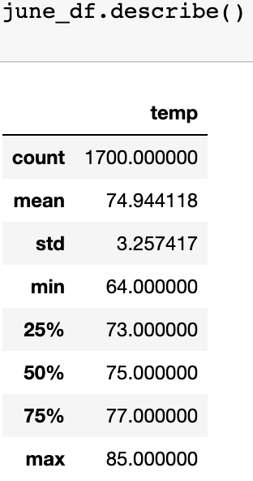

# Surf Shop Weather Analysis

## Overview of the Analysis
### Purpose
The purpose of this analysis is to provide a potential investor, W. Avy, and his board of directors with an analysis of weather patterns that will support opening a surf and ice cream shop in Oahu, Hawaii. As W. Avy experienced with a failed prior business venture, preparing to open a business requires research and analysis of various factors depending on the needs of the business. In this case, a surf and ice cream shop would be most successful in warmer climates where the business will attract more patrons. This analysis utilizes SQLAlchemy to query the SQLite database of Oahu weather data provided by W. Avy. 

## Results
### Temperature Analysis
The database contains weather data from 2010 - 2017. We analyzed data from June and December months. 
* The summary statistics of June month temperatures is based on the 1700 datapoints. It shows that the average temperature in June is 74.9 F with maximum and minimum temps being in the 85 and 64 F.
* There are 1517 datapoints for December temperatures. The summary statistics show an average temperature of 71 F. The maximum and minimum temperatures are 83 and 56 F. 
* The standard deviation is 3.26 degrees for June temperatures and 3.75 degrees for December. These are both fairly low values meaning there is not much variation in temperatures within the month and the you can expect daily temperatures to be around the month's average temperature. 

**Summary statistics for June temperatures**

**Summary statistics for December temperatures**

## Summary
### Review of Analysis
Based on the temperature analysis, Oahu does have ideal temperatures for a surf and ice cream shop location. There are two seasons in Hawaii: summer from May - October and winter from November - April. The temperature analysis shows temperature ranges during both seasons (June for summer months and December for winter months). The average temperatures for both June and December are in the 70s F. While the temperature does drop in the winter months with the minimum temperature in the high 50s F, it would still be possible to surf with the proper gear (ie. the proper wetsuit). And there would still be a potential for surfing business to continue. Although, it is likely to expect a decrease in ice cream sales when temperatures are in the 50s/60s. However, temperature heights did reach 83 F even in December so it would be unlikely to experience sustained lower temperatures even in the winter months. 

### Additional Queries
The analysis for the surf and ice cream shop location would benefit from some additional information. 
* Considering W. Avy's previous surf shop venture that failed due to rain, it would be worthwhile to perform a query on the precipitation of Oahu. There should be a query done on the `Measurement.prcp` data in the database. The wettest periods in Oahu are reportedly during the winter months specifically mid-November through late March. We can continue to use June and December as our comparison months to see precipitation levels throughout the year. 
* We could also provide a data visualization (such as a line chart) of the temperatures and precipitation in June and December so it will be easier for W. Avy and others to assess the temperature ranges. 
* We should also consider performing an analysis on wave data to support that our location will be in areas that are attractive to surfers. Our current database does not have this information. We would need to find another datasource from which we could obtain the data (such as swell conditions or wind patterns) and then perform an analysis. We could look at NOAA or other surfing forecasting databases as possible sources of data. 

